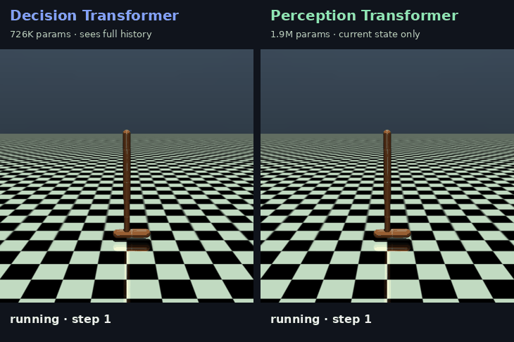
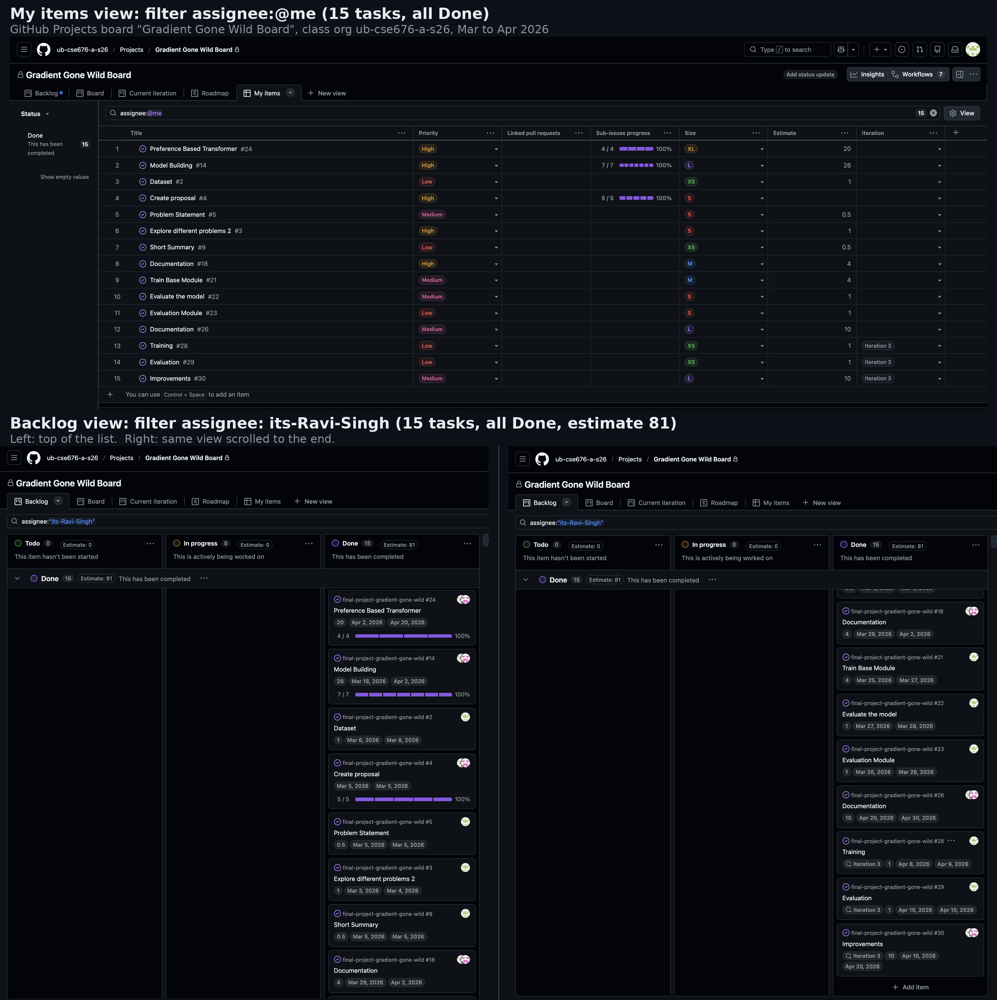
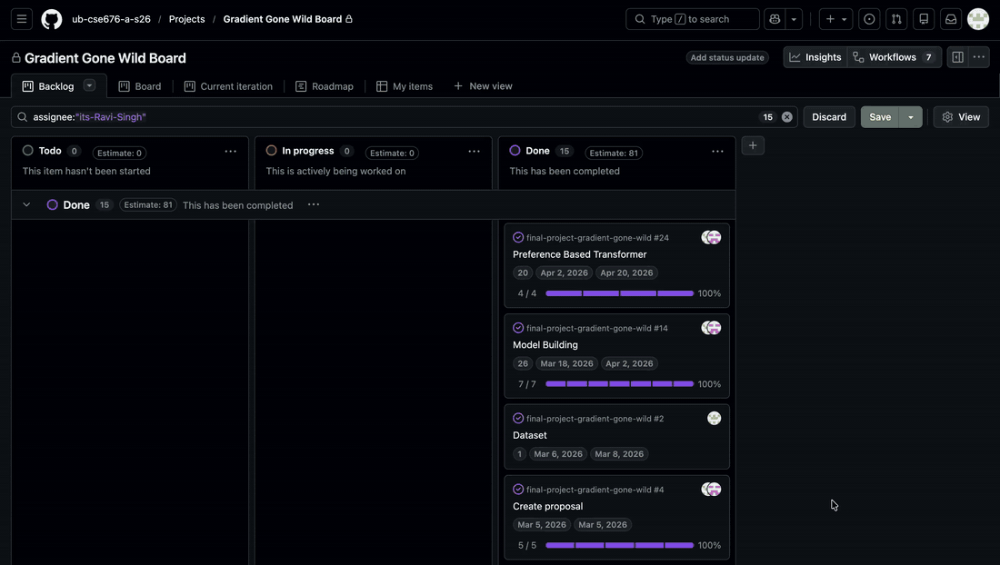

# Offline RL Decision Transformer with Preference Learning

**Deep Learning and Reinforcement Learning — Team Gradient Gone Wild**

**Members:** Ravi Rajaram Singh, Hemanth Phani Srinivas Chilamkurthy

We built an offline RL pipeline for MuJoCo continuous control. The main idea was to train a Decision Transformer on Hopper trajectories and then add a preference learning pipeline to study what happens when preference labels are noisy or wrong.

## Highlights

- Trained return-conditioned transformer policies purely from fixed offline data, with no online environment interaction during training.
- Benchmarked three models on the D4RL Hopper simple, medium and expert splits.
- Preference-weighted Decision Transformer beat the plain Decision Transformer on all three splits (for example, 24.0 to 67.4 on medium).
- Deployed as a Gradio web demo with an action predictor and a live Hopper rollout video.

## Demo



One example rollout from our trained checkpoints: the Decision Transformer falls early, while the Perception Transformer keeps hopping. This is a single episode, not an average. The 5-episode evaluation results are in the benchmark table below.

## What We Did

1. Trained return-conditioned transformer policies from fixed offline data — no online environment interaction during training.
2. Compared Decision Transformer, DT + Preference, and Perception Transformer across Hopper simple, medium, and expert splits.
3. Generated segment-level preference pairs from offline trajectories.
4. Trained a preference model, analyzed its errors, and used it to reweight Decision Transformer training windows.

We started with CartPole for quick testing but moved to the real D4RL Hopper benchmark after the checkpoint feedback.

## Repository Structure

```text
.
|-- main.py                         # train + eval Decision Transformer on one dataset
|-- d4rl_compare.py                 # benchmark DT and Perception on all three Hopper splits
|-- d4rl_compare_three.py           # benchmark DT, DT + Preference, and Perception
|-- train.py                        # training loop shared by both models
|-- evaluate.py                     # live Gymnasium rollout evaluation
|-- train_perception.py             # train the Perception Transformer
|-- compare_models.py               # compare saved checkpoints side by side
|-- train_preference.py             # generate preference pairs, train preference model
|-- analyze_preference_errors.py    # see where the preference model gets it wrong
|-- deploy.py                       # quick rollout smoke test
|-- gradio_app.py                   # Gradio web demo (action predictor + Hopper video)
|-- data/
|   `-- dataset.py                  # trajectory buffer, sequence windows, preference pairs
|-- models/
|   |-- decision_transformer.py     # causal sequence model (our main policy)
|   |-- perception_transformer.py   # Perceiver-style comparison policy
|   `-- preference_model.py         # segment preference model
|-- d4rl_results/                   # benchmark plots, summaries, checkpoints
|-- saved_models/                   # deployable checkpoints
|-- docs/                           # project board screenshots and walkthrough GIF
|-- DEPLOYMENT.md                   # how to run the demo
`-- REPORT.md                       # project report
```

## Setup

We used Python 3.10.

```bash
python3 -m venv .venv
source .venv/bin/activate
pip install -r requirements.txt
```

Minari will download the datasets automatically on first run.

## Train the Decision Transformer

```bash
python3 main.py
```

Default settings:

| Setting | Value |
| --- | --- |
| Dataset | `mujoco/hopper/expert-v0` |
| Environment | `Hopper-v4` |
| Epochs | `50` |
| Batch size | `256` |
| Context length | `20` |
| Target RTG | `3000.0` |

Override with env vars:

```bash
DATASET_ID=mujoco/hopper/medium-v0 EPOCHS=30 python3 main.py
```

By default, if a trained preference model exists, `main.py` uses it to weight DT sequence windows. To train the normal DT without preference weighting:

```bash
USE_PREFERENCE_WEIGHTS=0 python3 main.py
```

## Run the Benchmark

```bash
EPOCHS=10 BATCH_SIZE=512 CONTEXT_LEN=8 N_EVAL=10 MAX_WINDOWS=10000 python3 d4rl_compare.py
```

Trains both models on all three Hopper splits and saves results to `d4rl_results/`.

For the final three-way benchmark:

```bash
EPOCHS=10 BATCH_SIZE=512 CONTEXT_LEN=8 N_EVAL=5 MAX_WINDOWS=10000 python3 d4rl_compare_three.py
```

This compares Decision Transformer, DT + Preference, and Perception Transformer.

Latest three-way benchmark (evaluation return, using the settings in the command above):

| Split | Decision Transformer | DT + Preference | Perception Transformer |
| --- | ---: | ---: | ---: |
| Simple | 60.4 | 76.2 | 593.5 |
| Medium | 24.0 | 67.4 | 555.3 |
| Expert | 68.6 | 88.3 | 80.6 |

The preference-weighted DT improved over the normal DT on all three splits. Perception was strongest on simple and medium, while DT + Preference was strongest on expert.

These runs use short training (10 epochs, 10,000 windows) and 5 evaluation episodes, so treat the numbers as indicative of the trend rather than final benchmark scores.

## Model Architecture

| Model | Hidden Dim | Layers | Heads | Main Input |
| --- | ---: | ---: | ---: | --- |
| Decision Transformer | 128 | 3 | 4 | RTG, state, action sequence |
| DT + Preference | 128 | 3 | 4 | Same DT architecture with weighted sequence loss |
| Perception Transformer | 256 | 2 | 4 | Current state and RTG |
| Preference Model | 128 | 2 | 4 | Paired trajectory segments |

Decision Transformer turns each timestep into three tokens: RTG, state, and action. With context length 8, that gives 24 tokens per window. Perception Transformer uses 8 learned latent tokens and cross-attention over the state and RTG tokens. The preference model scores trajectory segments and gives higher weights to windows that look better.

## Preference Learning

```bash
python3 train_preference.py --dataset-id mujoco/hopper/medium-v0 --num-pairs 10000 --segment-len 20 --epochs 20
```

Labels are based on segment return — whichever segment has higher total reward is labeled as preferred. You can also add noise to test how robust the model is:

```bash
python3 train_preference.py --label-noise 0.2 --num-pairs 10000
```

## Preference Error Analysis

```bash
python3 analyze_preference_errors.py
```

Checks where the model was wrong and how confident it was when it messed up. Saves flagged cases to `preference_results/preference_error_cases.csv`.

## Preference-Weighted DT

After preference training, DT windows are scored by the preference model. Higher-score windows get larger sample weights in the DT action MSE loss:

```text
higher preference score -> larger DT loss weight
lower preference score -> smaller DT loss weight
```

This is offline preference-weighted behavior cloning, not full online RLHF.

## Deployment

Launch using Gradio:

```bash
MODEL_CHECKPOINT=saved_models/decision_transformer_d4rl.pth python3 gradio_app.py
```

Then open `http://127.0.0.1:8000`. Tab 1 lets you test the action predictor, Tab 2 runs a live Hopper episode and records a video.

## Project Management

We tracked the work on a GitHub Projects board (23 tasks in total) in our class organization. I was assigned 15 of them, some shared with my teammate, covering the proposal, dataset, model building, training, evaluation, documentation and improvements, from Mar 3 to Apr 30, 2026. All 15 are marked Done.





The board lives in the private class organization, so these screenshots are the proof. The commit history in this repo shows the same work.

## References

- Chen et al. *Decision Transformer: Reinforcement Learning via Sequence Modeling*, NeurIPS 2021. [[arxiv]](https://arxiv.org/abs/2106.01345)
- Fu et al. *D4RL: Datasets for Deep Data-Driven Reinforcement Learning*, 2020. [[arxiv]](https://arxiv.org/abs/2004.07219)
- Christiano et al. *Deep Reinforcement Learning from Human Preferences*, NeurIPS 2017. [[arxiv]](https://arxiv.org/abs/1706.03741)
- Farama Foundation. Minari documentation. [[docs]](https://minari.farama.org/)
- Farama Foundation. Gymnasium MuJoCo environments. [[docs]](https://gymnasium.farama.org/environments/mujoco/)
