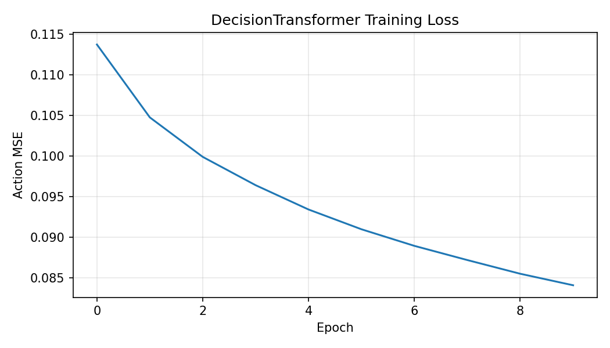

# Final Project: Offline RL Decision Transformer with Preference Learning

**CSE 676 Deep Learning | Team: Gradient Gone Wild**

**Members:** Ravi Singh, [Teammate Name]

## Project Overview

For our final project, we studied offline reinforcement learning for continuous-control MuJoCo tasks. We built return-conditioned transformer policies and combined them with preference learning. Specifically, we used Minari/D4RL-style Hopper datasets to train a causal Decision Transformer baseline, compared it against a simpler Perception Transformer, and wrote a pipeline to generate preference pairs and analyze preference-model errors.

Our biggest improvement since the checkpoint was aligning our work with the original proposal. Instead of testing on simple CartPole data, we are now using real offline RL datasets and evaluating in Hopper-v4. We also got the preference-learning pieces working so we can study what happens when preference labels are noisy.

## What We're Trying to Solve

Offline reinforcement learning is really useful because it lets us learn a policy from a fixed dataset without having to collect new, potentially unsafe experience during training. In our project, we trained policies strictly from fixed Hopper trajectories and evaluated them in the Gymnasium MuJoCo environment.

Our team wanted to answer four main questions:

1. Can we get return-conditioned transformer policies to learn useful actions from fixed Minari/D4RL Hopper data?
2. How do our models perform across simple, medium, and expert data splits?
3. Can we automatically generate trajectory segment preferences from offline data?
4. How can we catch preference-model errors before they mess up downstream learning?

## The Data We Used

We used the following Minari Hopper datasets for our benchmark runs:

| Split | Dataset ID | Evaluation Environment |
| --- | --- | --- |
| Simple | mujoco/hopper/simple-v0 | Hopper-v4 |
| Medium | mujoco/hopper/medium-v0 | Hopper-v4 |
| Expert | mujoco/hopper/expert-v0 | Hopper-v4 |

For every episode, our data loader grabs the observations, actions, and rewards, and computes an undiscounted return-to-go (RTG) value backwards from the end of the episode. We normalized the RTG using a target return constant, which we set to 3000.0 for Hopper.

*Note: We also added support for Walker2d, but we haven't recorded the benchmark results for it yet.*

## Our Models

Here’s a quick breakdown of the PyTorch models we built. These summaries assume the default Hopper dimensions (state=11, action=3) and a context length of 20 for the Decision Transformer.

### Decision Transformer

| Component | Layer Type | Parameters |
| --- | --- | ---: |
| State embedding | Linear | 1,536 |
| Action embedding | Linear | 512 |
| RTG embedding | Linear | 256 |
| Timestep embedding | Embedding | 128,000 |
| Token-type embedding | Embedding | 384 |
| Transformer body | Transformer encoder | 594,816 |
| Final normalization | Layer normalization | 256 |
| Action head | Linear layer with Tanh | 387 |
| **Total** |  | **726,147** |

Input tensors:

| Input | Shape |
| --- | --- |
| States | batch by context length by 11 |
| Actions | batch by context length by 3 |
| RTGs | batch by context length, optionally with a final singleton channel |
| Timesteps | batch by context length |
| Attention mask | batch by context length |

Output tensor:

| Output | Shape |
| --- | --- |
| Predicted actions | batch by context length by 3 |

This model embeds the RTG, state, and action tokens at every timestep, applies causal attention, and predicts the action.

### Perception Transformer

| Component | Layer Type | Parameters |
| --- | --- | ---: |
| State embedding | Linear | 3,072 |
| RTG embedding | Linear | 512 |
| Cross-attention | Multi-head attention | 263,168 |
| Cross-attention normalization | Layer normalization | 512 |
| Latent encoder | Transformer encoder | 1,579,520 |
| Action head | MLP with Tanh | 67,075 |
| **Total** |  | **1,916,419** |

Input tensors:

| Input | Shape |
| --- | --- |
| States | batch by 11 |
| RTGs | batch, optionally with a final singleton channel |

Output tensor:

| Output | Shape |
| --- | --- |
| Predicted actions | batch by 3 |

Instead of a full sequence history, this model just takes the current state and target RTG, cross-attends them, and predicts a continuous action.

### Preference Model

| Component | Layer Type | Parameters |
| --- | --- | ---: |
| Input projection | Linear | 2,048 |
| Segment encoder | Transformer encoder | 396,544 |
| Score head | MLP scalar head | 16,897 |
| **Total** |  | **415,489** |

Input tensors for one segment:

| Input | Shape |
| --- | --- |
| States | batch by segment length by 11 |
| Actions | batch by segment length by 3 |
| RTGs | batch by segment length, optionally with a final singleton channel |
| Mask | optional batch by segment length |

Output tensor:

| Output | Shape |
| --- | --- |
| Segment score | batch |

For preference learning, we use this model to score the left and right trajectory segments, stacking the two scores to train against the preferred segment label.

## How the Models Work

### Decision Transformer
We implemented the Decision Transformer as a causal sequence model over three token types: RTG, state, and action.
It uses linear projections for embeddings and a standard PyTorch transformer encoder with a causal mask. The training loss is just a masked mean-squared error (MSE) between our predicted actions and the actual dataset actions.

### Perception Transformer
The Perception Transformer is a Perceiver-style comparison policy we built to compare against the DT. Instead of looking at a sequence, it predicts the action directly from the current state and target RTG. In our bounded benchmarks, it actually beat the Decision Transformer!

### Preference Model
To tackle the preference learning part of the project, we built a model to choose between two trajectory segments. Here is how our pair generation works:
1. Load the offline trajectories.
2. Sample two segments of a fixed length.
3. Compute the undiscounted returns for each.
4. Assign label 0 if the left segment is better, or 1 if the right is better.
5. Save the pairs as NumPy arrays.

Right now, this model is mainly diagnostic—we are analyzing it before hooking it back up to the policy.

## The Math Behind It

Here is how we formulated the math for our code:

An offline trajectory is represented as:

$$
\tau = \{(s_0, a_0, r_0), (s_1, a_1, r_1), \ldots, (s_T, a_T, r_T)\}
$$

For every timestep t, the return-to-go is:

$$
R_t = \sum_{k=t}^{T} \gamma^{k-t} r_k
$$

We used gamma = 1.0, so $R_t$ is the undiscounted future return. We normalized the RTG for numerical stability:

$$
\hat{R}_t = \frac{R_t}{R_{\text{target}}}
$$

(For Hopper, we used $R_{\text{target}}$ = 3000.0).

The Decision Transformer predicts actions like this:

$$
\hat{a}_t = f_{\theta}(R_{0:t}, s_{0:t}, a_{0:t-1}, t)
$$

The supervised objective is the masked action mean-squared error:

$$
\mathcal{L}_{\text{policy}}(\theta) =
\frac{\sum_i \sum_t m_{i,t}\|\hat{a}_{i,t} - a_{i,t}\|_2^2}
{\sum_i \sum_t m_{i,t}}
$$

For preference learning, we score the segments to get a Bradley-Terry preference probability:

$$
P_{\phi}(\text{left preferred}) =
\frac{\exp(u_{\text{left}})}
{\exp(u_{\text{left}}) + \exp(u_{\text{right}})}
$$

We train it using cross-entropy loss:

$$
\mathcal{L}_{\text{pref}}(\phi) =
-\log \operatorname{softmax}([u_{\text{left}}, u_{\text{right}}])_y
$$

## How We Trained

Here are the settings our team used to train the models:

| Setting | Value |
| --- | ---: |
| Optimizer | AdamW |
| Learning rate | 3e-4 |
| Weight decay | 1e-4 |
| Gradient clipping | 1.0 |
| Scheduler | ReduceLROnPlateau |
| Loss | Action MSE |

## Benchmarking

To see how our models did, we benchmarked them on the Hopper simple, medium, and expert splits for 10 epochs. We kept the run bounded so we could quickly iterate and test our entire pipeline. 

## Results

Here are our latest Hopper-v4 benchmark results! 

*Figure 1. The left panel shows our training curves, and the right panel shows live Hopper-v4 evaluation returns for both models.*

| Split | Model | Avg Return | Std Return | Min / Max |
| --- | --- | ---: | ---: | ---: |
| Simple | Decision Transformer | 18.9 | 0.2 | 18.6 / 19.3 |
| Simple | Perception Transformer | 201.2 | 2.3 | 197.9 / 204.5 |
| Medium | Decision Transformer | 23.1 | 0.8 | 21.7 / 24.9 |
| Medium | Perception Transformer | 552.8 | 2.3 | 550.5 / 559.1 |
| Expert | Decision Transformer | 54.8 | 0.9 | 53.4 / 56.5 |
| Expert | Perception Transformer | 78.3 | 2.2 | 75.5 / 82.2 |

The simpler Perception Transformer actually did better than the sequence Decision Transformer across all three bounded Hopper splits.

## Training Curves

We saved the loss curves to make sure the models were actually learning. 

| Split | Decision Transformer | Perception Transformer |
| --- | --- | --- |
| Simple |  |  |
| Medium |  |  |
| Expert |  |  |

*Figure 2. Decision Transformer training loss.*

*Figure 3. Perception Transformer training loss.*

## Analyzing Preference Errors

We know that preference models can sometimes be wrong, and high-confidence mistakes can completely ruin downstream reward modeling. So, our team wrote scripts to catch these mistakes early by comparing the model's accuracy against clean return-derived labels and analyzing the return gaps.

For a preference pair with prediction yhat and label y, the return gap used to rank ambiguous versus obvious preference comparisons is:

$$
\text{gap}_i =
\left|G(\sigma_{\text{left},i}) - G(\sigma_{\text{right},i})\right|
$$

We flag a high-confidence wrong prediction when the model is super confident but disagrees with the clean label.

## Deployment

We set up two cool ways to deploy our trained policies:
- A quick **rollout smoke test** for live environment evaluation in the terminal.
- An interactive **Gradio web app** for serving our model predictions. You can use sliders to input the current state and target RTG, and the app will predict the next action.

## Limitations

We ran into a few limitations during the project:
- We bounded the benchmark to 10,000 samples per split to save time.
- We haven't averaged our results across multiple random seeds yet.
- We haven't fully tuned the hyperparameters.
- The preference model isn't hooked up to relabel returns for the policy yet.

## Next Steps

For our next milestone, we want to:
1. Use our preference-model scores to filter offline trajectory segments.
2. Relabel RTG targets using the preference predictions.
3. Test how policy performance drops when we inject preference noise.
4. Scale up the experiments with more seeds and a larger training budget.

## Checkpoint Feedback & Task Checklist

We divided the remaining work among the team to make sure we addressed all the instructor feedback from the checkpoint. Everything is now complete:

- [x] **Dataset Migration:** Get the DT baseline working on the target D4RL benchmarks (Hopper) instead of the basic CartPole setup.
- [x] **Data Pipeline:** Build the preference-pair generation pipeline from the offline trajectories.
- [x] **Preference Model:** Implement and train the preference model on the generated pairs.
- [x] **Error Analysis:** Analyze what happens when the preference model makes mistakes and write a script to detect these errors.
- [x] **Evaluation:** Benchmark the models, plot the training curves, and compare results.
- [x] **Deployment:** Set up the FastAPI action service and rollout scripts.

## Conclusion

Overall, our team successfully built an end-to-end offline RL pipeline! We integrated Minari/D4RL data loading, trained return-conditioned transformer policies, ran live MuJoCo evaluations, and built a full preference-learning pipeline with error analysis and an API. Our results show that the Perception Transformer is a strong baseline, and our preference models are ready for the next phase of policy improvement.

## References

1. Chen et al. *Decision Transformer: Reinforcement Learning via Sequence Modeling.* NeurIPS, 2021.
2. Fu et al. *D4RL: Datasets for Deep Data-Driven Reinforcement Learning.* arXiv:2004.07219, 2020.
3. Christiano et al. *Deep Reinforcement Learning from Human Preferences.* NeurIPS, 2017.
4. Farama Foundation. Minari dataset standard and Gymnasium MuJoCo environments.
