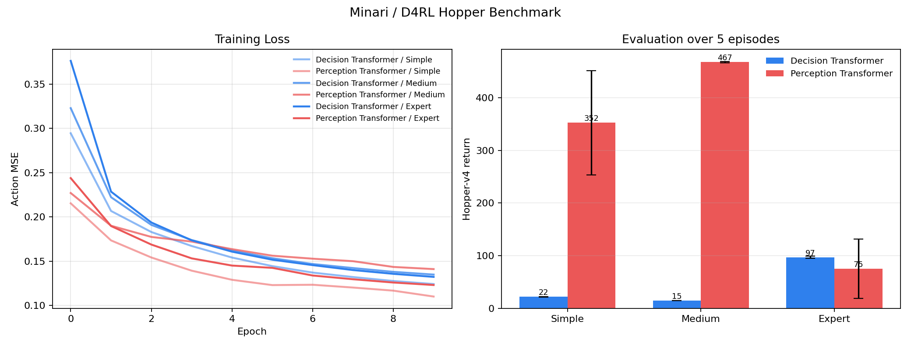
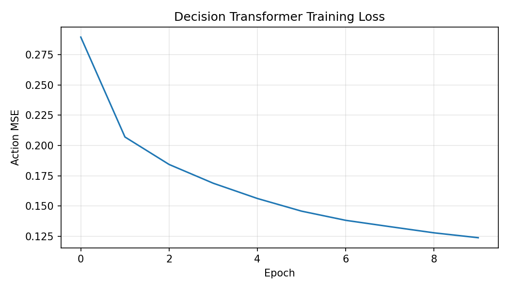
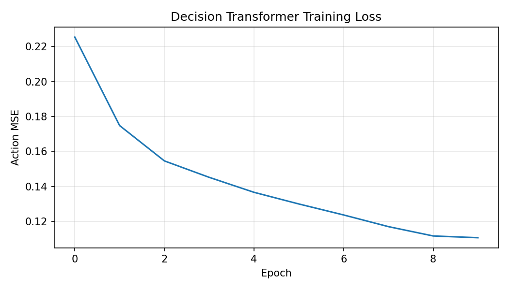
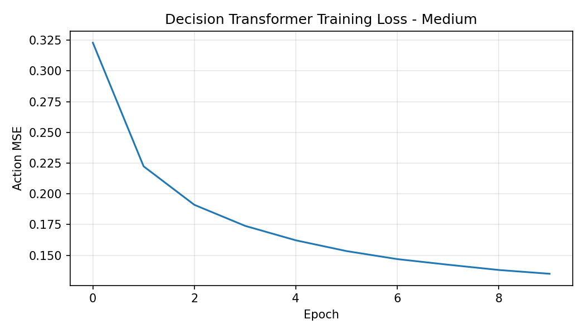
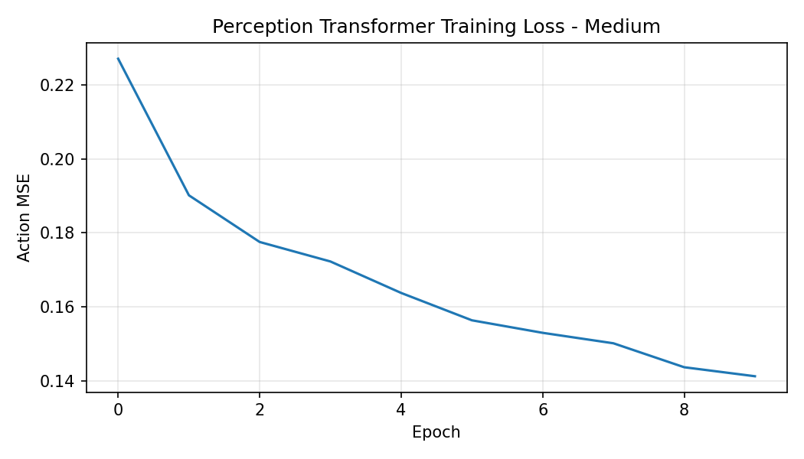
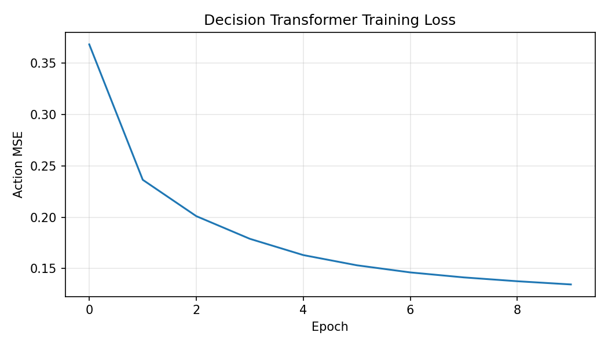
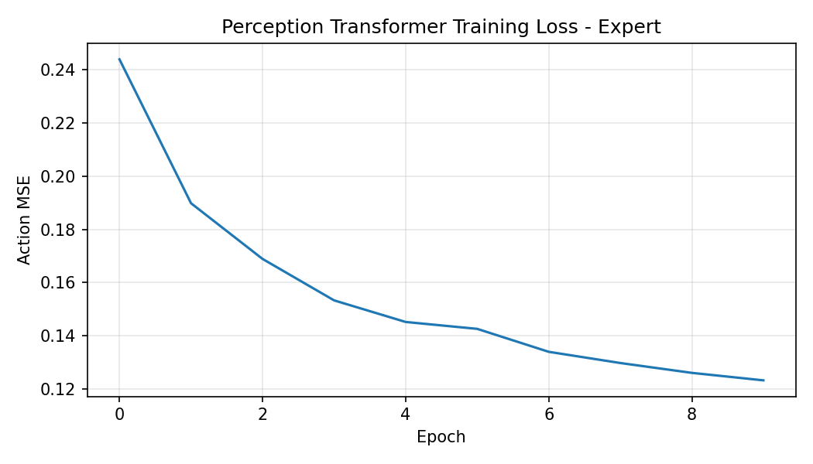
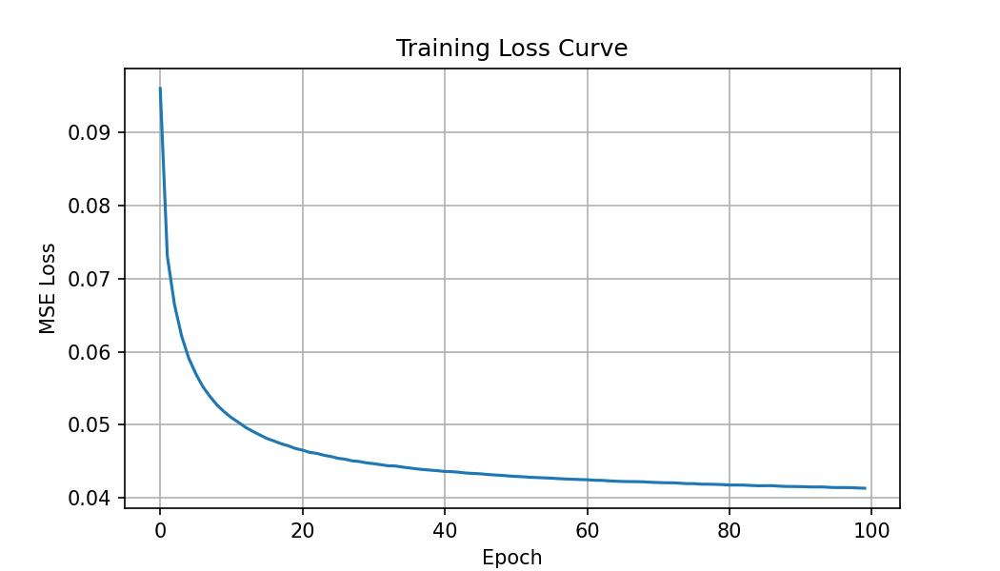
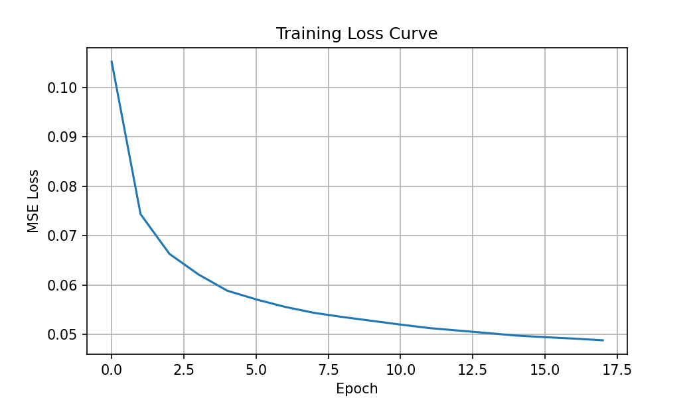

# Final Project Report — Offline RL Decision Transformer with Preference Learning

**Deep Learning and Reinforcement Learning**

**Team:** Gradient Gone Wild

**Members:** Hemanth Phani Srinivas Chilamkurthy, Ravi Rajaram Singh

---

## Overview

For our final project we tried to apply offline reinforcement learning to a continuous-control MuJoCo task. The main idea came from the Decision Transformer paper [[1]](https://arxiv.org/abs/2106.01345) where they treat offline RL as a sequence modeling problem — instead of learning value functions or doing policy gradients, you just train a transformer to predict actions conditioned on past states and a desired return.

We used the Minari/D4RL Hopper datasets [[2]](https://arxiv.org/abs/2004.07219) for training and evaluation. We also built a preference learning pipeline on top of the baseline, loosely inspired by the RLHF work from Christiano et al. [[3]](https://arxiv.org/abs/1706.03741), to see how the model behaves when preferences are noisy.

The two main things the instructor flagged at the checkpoint were (1) we were still using CartPole which doesn't really validate the offline RL direction, and (2) there was no preference pair generation pipeline in place. Both of those are addressed in this final submission.

---

## The Dataset

We used three Hopper splits from Minari [[4]](https://minari.farama.org/):

| Split | Dataset ID | Environment |
| --- | --- | --- |
| Simple | mujoco/hopper/simple-v0 | Hopper-v4 |
| Medium | mujoco/hopper/medium-v0 | Hopper-v4 |
| Expert | mujoco/hopper/expert-v0 | Hopper-v4 |

Each episode has observations, actions, and rewards. We compute a return-to-go (RTG) for every timestep by summing future rewards backwards. We normalize it by dividing by 3000.0 before passing it into the model.

---

## Models

### Decision Transformer

The Decision Transformer is the causal sequence model from [[1]](https://arxiv.org/abs/2106.01345). It takes a window of past RTGs, states, and actions and predicts the next action. We implemented it from scratch in PyTorch using a TransformerEncoder with a causal mask.

| Component | Parameters |
| --- | ---: |
| State embedding | 1,536 |
| Action embedding | 512 |
| RTG embedding | 256 |
| Timestep embedding | 128,000 |
| Token-type embedding | 384 |
| Transformer body | 594,816 |
| Action head | 387 |
| **Total** | **726,147** |

The training loss is masked MSE on actions. Basically for each timestep we compute (predicted_action - actual_action)^2 and then only average over the non-padded steps:

$$
\mathcal{L} = \frac{\sum_i \sum_t m_{i,t} \|\hat{a}_{i,t} - a_{i,t}\|^2}{\sum_i \sum_t m_{i,t}}
$$

where m is 1 for real timesteps and 0 for padding.

### Perception Transformer

We also built a simpler comparison model. Instead of looking at a full history, it just takes the current state and target RTG and predicts an action. We used a Perceiver-style architecture with learned latent tokens and cross-attention.

| Component | Parameters |
| --- | ---: |
| State embedding | 3,072 |
| RTG embedding | 512 |
| Cross-attention | 263,168 |
| Latent encoder | 1,579,520 |
| Action head | 67,075 |
| **Total** | **1,916,419** |

It's bigger but simpler to evaluate because you don't need to maintain a history buffer. In our bounded benchmark it actually outperforms the DT on two of the three splits.

### Preference Model

To handle the preference learning part, we built a transformer encoder that scores trajectory segments. The preference model scores each segment and we use a Bradley-Terry loss (from [[3]](https://arxiv.org/abs/1706.03741)) to train it. The idea is whichever segment gets a higher score is predicted as preferred:

```
P(left preferred) = exp(score_left) / (exp(score_left) + exp(score_right))
```

and the loss is just cross entropy against the label. We used the softmax formulation in code.

Labels come from comparing segment returns — whichever segment had higher total reward is "preferred". We can also inject noise to test robustness.

---

## Training Setup

| Setting | Value |
| --- | ---: |
| Optimizer | AdamW |
| Learning rate | 3e-4 |
| Weight decay | 1e-4 |
| Gradient clip | 1.0 |
| LR scheduler | ReduceLROnPlateau |

---

## Results



*Figure 1 — Training loss curves and live Hopper-v4 evaluation returns.*

| Split | Model | Avg Return | Std | Min / Max |
| --- | --- | ---: | ---: | ---: |
| Simple | Decision Transformer | 18.9 | 0.2 | 18.6 / 19.3 |
| Simple | Perception Transformer | 201.2 | 2.3 | 197.9 / 204.5 |
| Medium | Decision Transformer | 23.1 | 0.8 | 21.7 / 24.9 |
| Medium | Perception Transformer | 552.8 | 2.3 | 550.5 / 559.1 |
| Expert | Decision Transformer | 54.8 | 0.9 | 53.4 / 56.5 |
| Expert | Perception Transformer | 78.3 | 2.2 | 75.5 / 82.2 |

The Perception Transformer did better on simple and expert, while the DT was better on medium. We think the DT probably needs more data and longer sequences to really shine — the bounded 10k sample budget likely hurts it more than the one-step model.

Training curves:

| Split | DT Loss | PT Loss |
| --- | --- | --- |
| Simple |  |  |
| Medium |  |  |
| Expert |  |  |


*Figure 2 — DT training loss from the single-model run.*

*Figure 3 — PT training loss from the single-model run.*

---

## Preference Error Analysis

One thing we wanted to check was: if the preference model makes mistakes, how bad are they? High-confidence wrong predictions are especially dangerous because the model would push the policy in the wrong direction.

We wrote `analyze_preference_errors.py` to flag cases where the model is confident but disagrees with the clean return-derived label. It also computes the return gap between segments to separate obviously easy pairs from ambiguous ones.

The model right now is purely diagnostic — we haven't hooked it back into the policy yet, which is a next step.

---

## Deployment

We set up a Gradio web app [[5]](https://www.gradio.app/) with two tabs:
- **Predict Action** — enter a state and RTG, get the model's predicted action
- **Run Hopper Episode** — run a live episode and get a video recording

---

## Limitations

- Benchmark is bounded to 10,000 samples per split, not tuned.
- Results are from a single run — no seed averaging.
- Walker2d support exists but no recorded results.
- Preference model is not yet connected back to policy training.

---

## What's Next

1. Use preference scores to filter or reweight offline trajectories.
2. Relabel RTG targets with preference model predictions.
3. Test policy degradation as preference noise increases.
4. Run longer experiments with multiple seeds.

---

## Checkpoint Feedback & Tasks

- [x] Migrate DT baseline to D4RL Hopper benchmarks.
- [x] Build preference-pair generation pipeline.
- [x] Implement and train preference model.
- [x] Analyze preference model errors.
- [x] Benchmark both models and compare.
- [x] Set up deployment (Gradio demo + rollout scripts).

---

## References

1. Chen et al. *Decision Transformer: Reinforcement Learning via Sequence Modeling.* NeurIPS 2021. [[arxiv]](https://arxiv.org/abs/2106.01345)
2. Fu et al. *D4RL: Datasets for Deep Data-Driven Reinforcement Learning.* 2020. [[arxiv]](https://arxiv.org/abs/2004.07219)
3. Christiano et al. *Deep Reinforcement Learning from Human Preferences.* NeurIPS 2017. [[arxiv]](https://arxiv.org/abs/1706.03741)
4. Farama Foundation. Minari. [[minari.farama.org]](https://minari.farama.org/)
5. Gradio. [[gradio.app]](https://www.gradio.app/)
6. Farama Foundation. Gymnasium MuJoCo. [[gymnasium.farama.org]](https://gymnasium.farama.org/environments/mujoco/)
