# Final Project Report — Offline RL Decision Transformer with Preference Learning

**Deep Learning and Reinforcement Learning**

**Team:** Gradient Gone Wild

**Members:** Ravi Rajaram Singh, Hemanth Phani Srinivas Chilamkurthy

> **Update (Oct 2026):** this is the report we submitted at the end of the course. After it, I found three bugs in the Decision Transformer pipeline (no state normalization, action history shifted by one step at evaluation, timesteps reset for every window). Fixing them raised the Decision Transformer's return 6-20x on every split (24.0 to 476.1 on medium) and changed some conclusions: preference weighting now helps on simple and expert but slightly hurts on medium, and the Perception Transformer only leads on medium. The result tables below are from before the fix. The current numbers are in the [README](README.md#benchmark).

---

## Overview

For our final project, we worked on offline reinforcement learning for a continuous-control MuJoCo task. The main idea came from the Decision Transformer paper [[1]](https://arxiv.org/abs/2106.01345), where offline RL is treated more like a sequence modeling problem. Instead of learning a value function or doing policy gradients, the model learns to predict actions from past states, past actions, and a desired return.

We used the Minari/D4RL Hopper datasets [[2]](https://arxiv.org/abs/2004.07219) for training and evaluation. On top of the Decision Transformer baseline, we added a preference learning pipeline, loosely inspired by the RLHF work from Christiano et al. [[3]](https://arxiv.org/abs/1706.03741). Our goal was to see whether preference labels could be used to guide offline policy training, and also to check what happens when those labels are noisy or wrong.

At the checkpoint, the two main issues were that we were still using CartPole and that we did not yet have preference pairs. CartPole was useful for debugging, but it was too simple for the actual offline RL direction. In the final version, we moved to Hopper and added preference pair generation, preference training, and preference error analysis.

---

## The Dataset

We used three Hopper splits from Minari [[4]](https://minari.farama.org/):

| Split | Dataset ID | Environment |
| --- | --- | --- |
| Simple | mujoco/hopper/simple-v0 | Hopper-v4 |
| Medium | mujoco/hopper/medium-v0 | Hopper-v4 |
| Expert | mujoco/hopper/expert-v0 | Hopper-v4 |

Each episode contains observations, actions, and rewards. For every timestep, we compute return-to-go (RTG) by summing future rewards backward through the episode. We then normalize RTG by dividing by 3000.0 before passing it into the model.

---

## Models

### Decision Transformer

The Decision Transformer is the causal sequence model from [[1]](https://arxiv.org/abs/2106.01345). It takes a window of past RTGs, states, and actions and predicts the next action. We implemented it in PyTorch using a TransformerEncoder with a causal mask.

Architecture details:

| Setting | Value |
| --- | ---: |
| State dimension | 11 |
| Action dimension | 3 |
| Hidden dimension | 128 |
| Transformer layers | 3 |
| Attention heads | 4 |
| Feedforward dimension | 512 |
| Dropout | 0.1 |

Each timestep is converted into three tokens: RTG, state, and action. So with context length 8 in the latest benchmark, the transformer sees 24 tokens per window. With the normal context length 20, it sees 60 tokens. Since the hidden size is 128 and there are 4 attention heads, each head works on 32 dimensions.

| Component | Parameters |
| --- | ---: |
| State embedding | 1,536 |
| Action embedding | 512 |
| RTG embedding | 256 |
| Timestep embedding | 128,000 |
| Token-type embedding | 384 |
| Transformer body | 594,816 |
| Action head | 387 |
| **Total** | **726,147** |

The training loss is masked MSE on actions. For each timestep, we compare the predicted action with the action from the dataset, then average only over real timesteps and ignore padding:

$$
\mathcal{L} = \frac{\sum_i \sum_t m_{i,t} \|\hat{a}_{i,t} - a_{i,t}\|^2}{\sum_i \sum_t m_{i,t}}
$$

where m is 1 for real timesteps and 0 for padding.

### Perception Transformer

We also built a simpler comparison model. Instead of looking at a full history, it just takes the current state and target RTG and predicts an action. We used a Perceiver-style architecture with learned latent tokens and cross-attention.

Architecture details:

| Setting | Value |
| --- | ---: |
| State dimension | 11 |
| Action dimension | 3 |
| Hidden dimension | 256 |
| Learned latent tokens | 8 |
| Transformer layers | 2 |
| Attention heads | 4 |
| Feedforward dimension | 1024 |
| Dropout | 0.1 |

The input has two tokens: one state token and one RTG token. The 8 learned latent tokens attend to those input tokens using cross-attention, then the latent tokens go through the transformer encoder. Since the hidden size is 256 and there are 4 heads, each attention head works on 64 dimensions.

| Component | Parameters |
| --- | ---: |
| State embedding | 3,072 |
| RTG embedding | 512 |
| Cross-attention | 263,168 |
| Latent encoder | 1,579,520 |
| Action head | 67,075 |
| **Total** | **1,916,419** |

This model is larger than the Decision Transformer, but it is simpler at evaluation time because it does not need a history buffer. In our bounded benchmark, it did better than the Decision Transformer on two of the three Hopper splits.

### Preference Model

For preference learning, we built a transformer encoder that scores trajectory segments. The model gives one score to the left segment and one score to the right segment. We train it with a Bradley-Terry style objective from [[3]](https://arxiv.org/abs/1706.03741), where the segment with the higher score is treated as the preferred one:

Architecture details:

| Setting | Value |
| --- | ---: |
| Input per timestep | state + action + RTG |
| Input dimension | 15 |
| Hidden dimension | 128 |
| Transformer layers | 2 |
| Attention heads | 4 |
| Feedforward dimension | 512 |

The preference model first projects each timestep from 15 dimensions to 128. It then runs a transformer encoder over the segment and averages the hidden states to get one segment representation. A small score head maps that representation to one scalar preference score. With 4 attention heads and hidden size 128, each head works on 32 dimensions.

```
P(left preferred) = exp(score_left) / (exp(score_left) + exp(score_right))
```

In the code, this is a softmax over the two segment scores followed by cross entropy against the preference label.

The labels are generated from segment returns. Whichever segment has higher total reward is marked as preferred. We can also flip a fraction of labels to simulate noisy preferences.

After training the preference model, we used it to score Decision Transformer training windows. We convert each score into a sample weight, so windows that look better to the preference model count more in the action MSE update:

$$
\mathcal{L}_{pref-DT} = \frac{\sum_i w_i \mathcal{L}_i}{\sum_i w_i}
$$

Here, \(w_i\) is the preference-derived weight for one trajectory window. This is not full online RLHF, but it gives us a practical way to connect the preference model back to offline policy training.

---

## Training Setup

| Setting | Value |
| --- | ---: |
| Optimizer | AdamW |
| Learning rate | 3e-4 |
| Weight decay | 1e-4 |
| Gradient clip | 1.0 |
| LR scheduler | ReduceLROnPlateau |

---

## Preference Training

The preference model is trained before it is used to update the Decision Transformer. We generate pairs of short trajectory segments from the offline Hopper data. Each pair has a left segment and a right segment, and each segment contains states, actions, and RTGs.

The preference label comes from the segment return. If the left segment has the higher total reward, the label is left. If the right segment has the higher total reward, the label is right. We also keep the clean label and the return gap so we can later check where the preference model makes mistakes.

For training, the preference model scores both segments:

```text
left segment -> score_left
right segment -> score_right
```

The two scores are treated as logits, and we train with cross entropy against the preferred side. This is the Bradley-Terry style setup described earlier.

In our preference run, we trained on 2,000 generated segment pairs for 5 epochs. The validation accuracy improved during training:

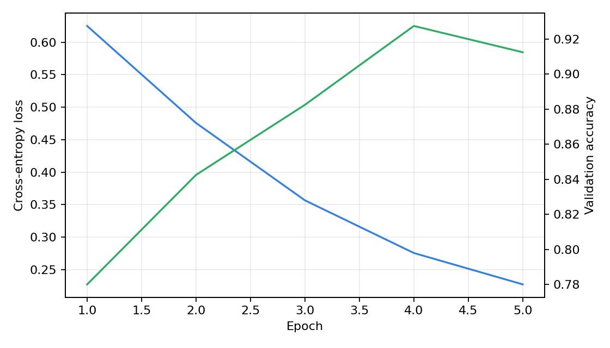

*Figure 1 — Preference model training loss and validation accuracy.*

| Epoch | Loss | Validation Accuracy |
| ---: | ---: | ---: |
| 1 | 0.6250 | 0.780 |
| 2 | 0.4756 | 0.843 |
| 3 | 0.3566 | 0.882 |
| 4 | 0.2755 | 0.927 |
| 5 | 0.2272 | 0.912 |

After training, we used this preference model to score Decision Transformer windows. Higher-scoring windows received larger weights in the DT action loss.

---

## Results

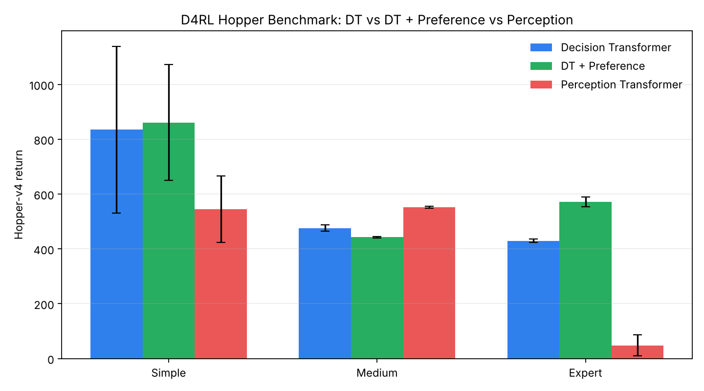

*Figure 2 — Three-way Hopper-v4 benchmark returns.*

| Split | Model | Avg Return | Std | Min / Max |
| --- | --- | ---: | ---: | ---: |
| Simple | Decision Transformer | 60.4 | 1.1 | 59 / 62 |
| Simple | DT + Preference | 76.2 | 1.6 | 75 / 79 |
| Simple | Perception Transformer | 593.5 | 3.7 | 589 / 599 |
| Medium | Decision Transformer | 24.0 | 1.0 | 23 / 26 |
| Medium | DT + Preference | 67.4 | 2.0 | 65 / 71 |
| Medium | Perception Transformer | 555.3 | 1.2 | 554 / 558 |
| Expert | Decision Transformer | 68.6 | 0.2 | 68 / 69 |
| Expert | DT + Preference | 88.3 | 1.8 | 86 / 90 |
| Expert | Perception Transformer | 80.6 | 4.7 | 75 / 87 |

For the final benchmark, we trained each model for 10 epochs with a bounded 10,000-sample budget and evaluated each one over 5 Hopper-v4 episodes. The preference version used the trained preference model to weight Decision Transformer training windows.

The main result is that DT + Preference improved over the normal Decision Transformer on all three splits. The improvement was small on simple, larger on medium, and also visible on expert. Perception Transformer still did much better on simple and medium, but on expert the preference-updated DT got the best average return.

This means the preference model did help the Decision Transformer, but it did not make it the strongest model overall. The one-step Perception Transformer was still much easier to train under the bounded setup.

### Saved Policy Benchmark

We also compared saved policies directly after the preference update. This separate check used the baseline DT, the preference-updated DT, and the Perception Transformer with the same Hopper-v4 evaluation setup.

| Model | Avg Return | Std | Min / Max |
| --- | ---: | ---: | ---: |
| Baseline DT | 23.6 | 0.7 | 23 / 24 |
| Preference-updated DT | 43.3 | 2.0 | 41 / 46 |
| Perception Transformer | 1325.6 | 655.7 | 36 / 1825 |

The preference-updated DT improved over the baseline DT in this saved-checkpoint run, which suggests that the preference weighting did move the policy in a useful direction. However, the Perception Transformer performed much better overall in that comparison. Its standard deviation was also very high, so the evaluation was not completely stable, but its average return was still far above both DT variants.

The main takeaway is that preference weighting helped the Decision Transformer, but it did not close the gap to the simpler Perception Transformer. We do not want to overclaim from this result because it uses only 5 evaluation episodes and a bounded 10,000-window fine-tuning set.


*Figure 3 — Saved policy benchmark comparing baseline DT, preference-updated DT, and Perception Transformer.*

Training curves from the 10-epoch benchmark:

| Split | DT Loss | DT + Preference Loss | Perception Loss |
| --- | --- | --- | --- |
| Simple | 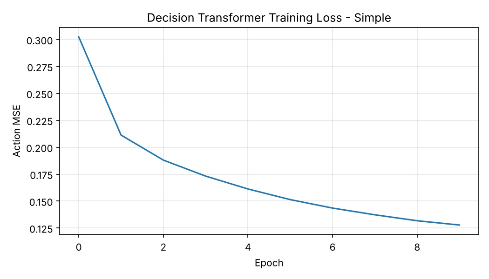 | 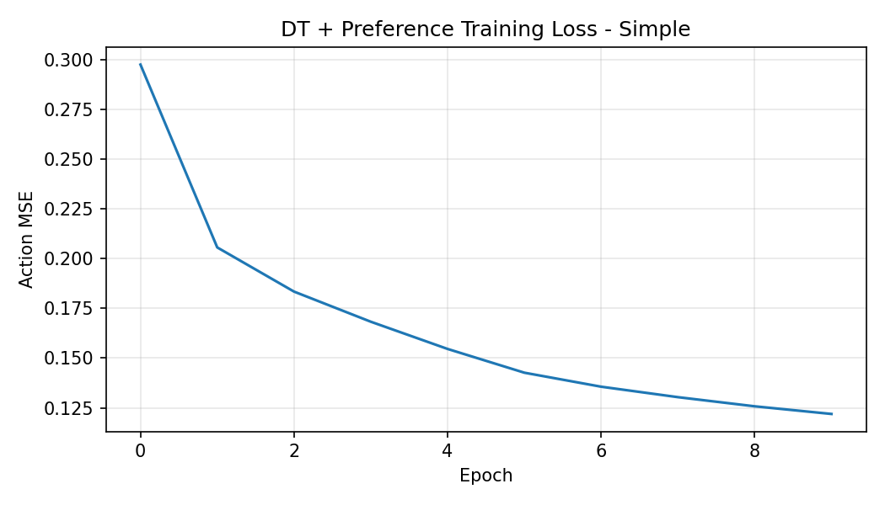 | 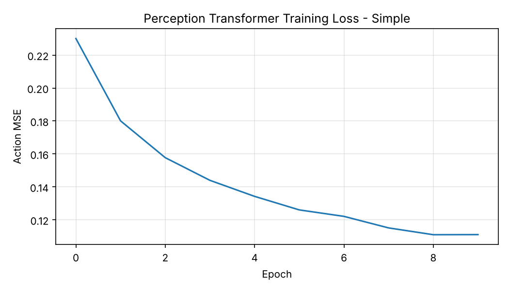 |
| Medium | 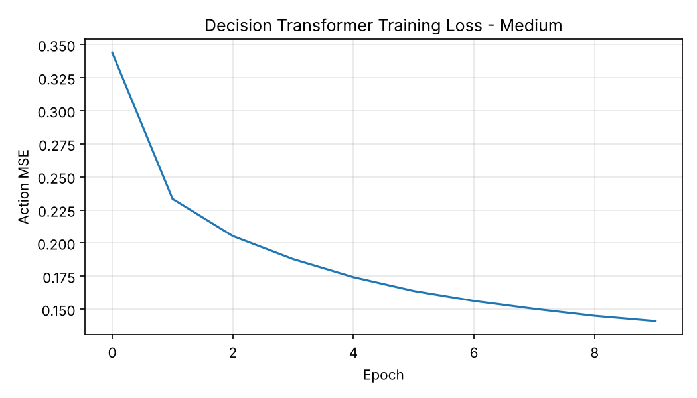 | 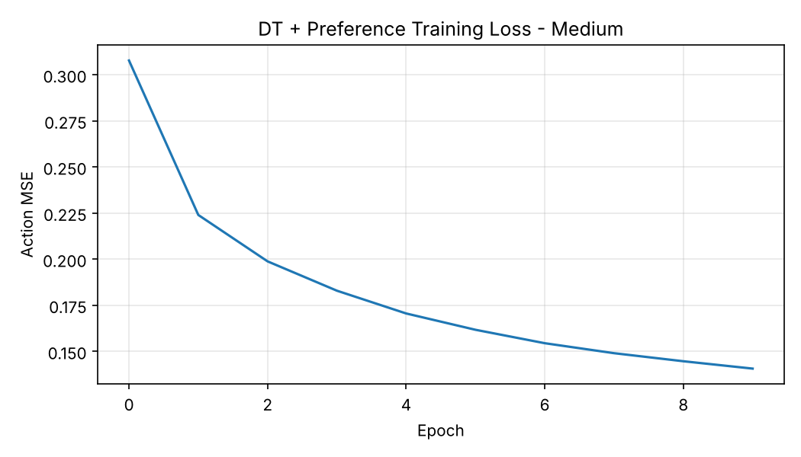 | 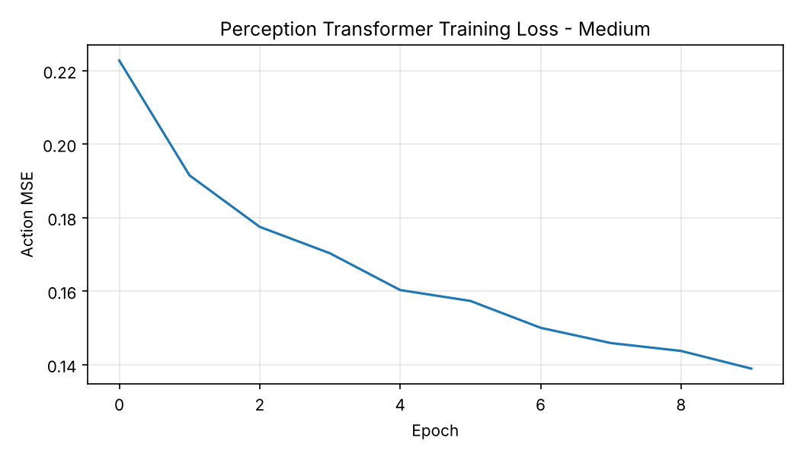 |
| Expert | 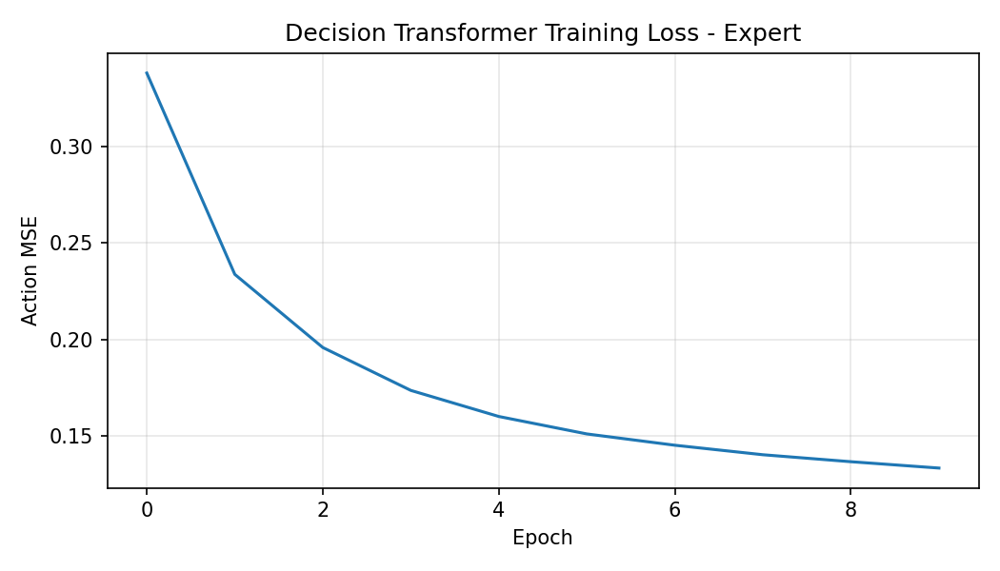 | 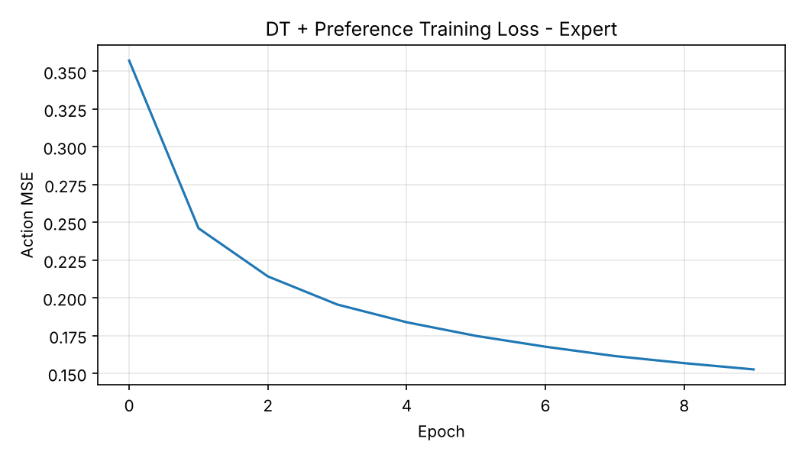 | 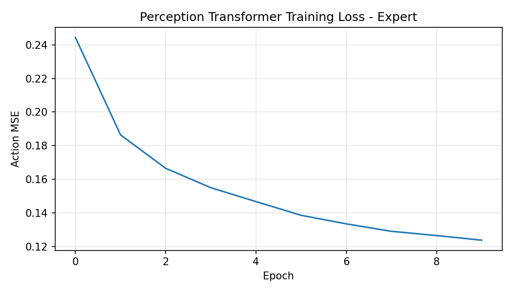 |

*Figure 4 — Training loss curves for the three-way 10-epoch benchmark.*

---

## Preference Error Analysis

One thing we wanted to check was how serious the preference model's mistakes were. High-confidence wrong predictions are the most concerning, because those are the cases where the model would push training in the wrong direction with a lot of confidence.

We added an error analysis step to flag cases where the model is confident but disagrees with the clean return-derived label. It also computes the return gap between segments, which helps separate obvious pairs from more ambiguous ones.

For the preference-update experiment, we used this trained model as a trajectory-window reweighting signal for the Decision Transformer. The error analysis still matters because high-confidence wrong preference predictions would increase the weight of bad training windows.

---

## Deployment

We also set up a Gradio web app [[5]](https://www.gradio.app/) with two tabs:
- **Predict Action** — enter a state and RTG, get the model's predicted action
- **Run Hopper Episode** — run a live episode and get a video recording

---

## Limitations

- Benchmark is bounded to 10,000 samples per split, not tuned.
- Results are from a single run — no seed averaging.
- Walker2d support exists but no recorded results.
- Preference model is connected through sample weighting, not through online reward learning or policy optimization.
- Preference-updated DT comparison uses only 5 evaluation episodes, so it is a sanity check rather than a stable benchmark.

---

## What's Next

1. Run the three-model benchmark with more evaluation episodes and multiple random seeds.
2. Tune the Decision Transformer more carefully, especially context length, number of windows, and training epochs.
3. Try stronger ways of using preferences, such as filtering low-score windows instead of only reweighting them.
4. Test how much label noise the preference model can handle before it starts hurting DT performance.
5. Run the same setup on Walker2d to check whether the results transfer beyond Hopper.

---

## References

1. Chen et al. *Decision Transformer: Reinforcement Learning via Sequence Modeling.* NeurIPS 2021. [[arxiv]](https://arxiv.org/abs/2106.01345)
2. Fu et al. *D4RL: Datasets for Deep Data-Driven Reinforcement Learning.* 2020. [[arxiv]](https://arxiv.org/abs/2004.07219)
3. Christiano et al. *Deep Reinforcement Learning from Human Preferences.* NeurIPS 2017. [[arxiv]](https://arxiv.org/abs/1706.03741)
4. Farama Foundation. Minari. [[minari.farama.org]](https://minari.farama.org/)
5. Gradio. [[gradio.app]](https://www.gradio.app/)
6. Farama Foundation. Gymnasium MuJoCo. [[gymnasium.farama.org]](https://gymnasium.farama.org/environments/mujoco/)
